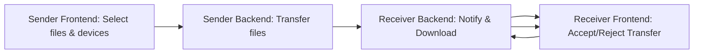

# IP Dropper

IP Dropper is a cross-platform desktop application that allows seamless file transfer and device management over a local network. It combines a **React** frontend, a **Node.js/Express** backend.


## Features

- **Device Discovery:** Detect devices connected to the same network
- **File Transfer:** Send and receive files between devices easily
- **Device Management:** Add, edit, and remove devices with custom details
- **Real-time Status:** View device connection status and transfer progress
- **Cross-Platform:** Runs on Windows, macOS, and Linux
- **Modern UI:** Built with React, TypeScript, and Vite for a fast, responsive interface with a glassy, modern design
- **Automatic Port Selection:** Automatically finds available ports if default ports are in use
- **History Tracking:** Keep track of all file transfers with detailed logs

## Architecture Overview

### Frontend (React + Vite)

- Located in `/frontend`
- Built with **React 19** and **TypeScript**
- Uses **Vite 6** for fast development and build
- Styled with **Bootstrap 5** and CSS Modules
- Provides UI components for device list, file upload, modals, and more
- Communicates with backend via REST APIs and WebSockets

### Backend (Node.js + Express)

- Located in `/backend`
- REST API server built with **Express.js**
- WebSocket server for real-time communication
- Handles device management, file transfer endpoints, and network operations
- Contains controllers, routes, services, and utility modules

## Technologies Used

- **Frontend:** React 19, TypeScript, Vite 6, Bootstrap 5
- **Backend:** Node.js, Express.js, WebSockets (ws)
- **Styling:** Bootstrap, CSS Modules, Custom Glassy UI Components
- **Package Management:** npm with Workspaces
- **Version Control:** Git

## Prerequisites

- [Node.js](https://nodejs.org/) (v18.18.0 or higher recommended)
- npm (comes with Node.js)

## Port Usage

The application dynamically selects available ports for both the frontend and backend services:

- **Frontend (Vite):** Default port 5173, automatically selects next available port if occupied
- **Backend API:** Default port 3000, automatically selects next available port if occupied
- **File Transfer Service:** Default port 3001, automatically selects next available port if occupied

You don't need to manually configure ports - the application will automatically find available ports if the defaults are in use.

## Getting Started

### 1. Clone the Repository

```bash
git clone https://github.com/Mohammad-Ali-Haider/ip-dropper.git ip-dropper
cd ip-dropper
```

### 2. Install Dependencies

At the root of the project, run:

```bash
npm install
```

This installs all necessary dependencies for the frontend, and backend using npm workspaces.

### 3. Run the Application

To start the app with both frontend and backend:

```bash
npm run dev
```

## Project Structure

```
root/
├── backend/          # Node.js backend server
│   ├── src/
│   │   ├── controllers/  # API endpoint handlers
│   │   ├── routes/       # API route definitions
│   │   ├── services/     # Business logic services
│   │   └── utils/        # Utility functions
│   └── package.json
├── frontend/         # React frontend app
│   ├── src/
│   │   ├── components/   # Reusable UI components
│   │   ├── context/      # React context providers
│   │   ├── hooks/        # Custom React hooks
│   │   ├── services/     # API client services
│   │   ├── styles/       # CSS and style files
│   │   ├── tabs/         # Main application tabs
│   │   └── types/        # TypeScript type definitions
│   ├── public/           # Static assets
│   └── package.json
├── package.json      # Root package.json with scripts and dependencies
└── README.md         # This file
```

## Usage

1. **Launch the app** and ensure devices are connected to the same local network
2. **Enable receiving mode** using the toggle in the sidebar to accept incoming files
3. **Add devices** manually with their IP addresses or use automatic discovery
4. **Select files** to send by dragging and dropping or using the file picker
5. **Choose target devices** from your device list (supports up to 3 devices per row)
6. **Send files** to the selected devices
7. **Accept incoming transfers** on the receiving device when prompted
8. **View transfer history** in the History tab

## Firewall Configuration

### Windows Defender Firewall

On Windows, you may need to configure Windows Defender Firewall to allow IP Dropper to communicate over your network:

1. **Allow through Firewall**: When prompted by Windows Security, click "Allow access" to permit IP Dropper through the firewall
2. **Manual Configuration**: If not prompted or if transfers fail:
   - Open Windows Defender
   - Click "Allow an app or feature through Windows Defender Firewall"
   - Click "Change settings" (requires administrator privileges)
   - Find IP Dropper in the list or click "Allow another app" to add it
   - **Important**: Make sure both "Private" and "Public" networks are checked
   - Click "OK" to save changes

> **Note**: Allowing the application through both Private and Public networks is essential for proper functionality, especially when connecting to devices on different network profiles.

## UI Features

- **Glassy Modern Design:** Translucent UI elements with subtle blur effects
- **Dark/Light Theme:** Fully customized themes with smooth transitions
- **Responsive Layout:** Adapts to different screen sizes and orientations
- **Modal Backdrop Blur:** Background blur effect when modals are open
- **Grid Layouts:** Optimized device and network interface displays
- **Animated Interactions:** Smooth animations for better user experience
- **Consistent Styling:** Unified design language across all components

## Data Flow Diagram



## License

This project is licensed under the MIT License.

## Author

- **Mohammad Ali Haider** - [GitHub](https://github.com/Mohammad-Ali-Haider)
